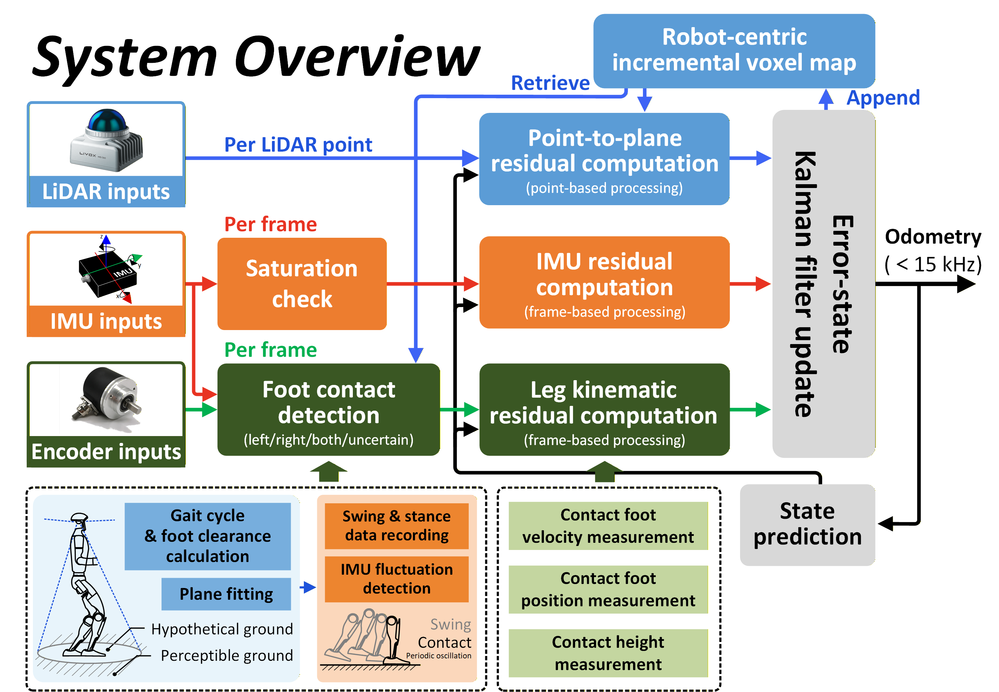

# HR<sup>2</sup>-KILO

**A High-Rate, Robust, Kinematic-Inertial-LiDAR Odometry for Humanoid Robots**

## 1. Introduction

**HR<sup>2</sup>-KILO** is a high-rate and robust multisensor fusion framework for state estimation of humanoid robots. This framework tightly couples the measurements from the joint encoder, inertial sensor, and LiDAR. We estimate states within the error-state Kalman filter, incorporating the pointwise update strategy, IMU measurement model, and multiple leg kinematic information. Moreover, acceleration fluctuations, foot positions, and the history map are utilized for online contact detection without any contact sensors.

<div align="center">
  <br/>    
  <span style="color:#a0a0a0; font-size:1em;">The system overview of HR<sup>2</sup>-KILO.</span>
</div>

### 1.1 Related paper

The paper has been accepted by RA-L 25, which is available: 
[HR<sup>2</sup>-KILO: A High-Rate, Robust, Kinematic-Inertial-LiDAR Odometry for Humanoid Robots](https://ieeexplore.ieee.org/document/11206479).

### 1.2 Our associate dataset

HR<sup>2</sup>-KILO dataset can be downloaded from [Google Drive](https://drive.google.com/drive/folders/1O8Mm1s-iD1Jlqc9AnVehYloeVd2RvJ_5?usp=sharing).

We have released a total of 4 sequences for humanoid robot SLAM in rosbag format.

The topic structure is as follows:

```
/g1/joint_state   : sensor_msgs/JointState      # Leg kinematics calculated based on default URDF (without additional rotation)
/g1/joint_state_r : sensor_msgs/JointState      # Leg kinematics in actual LiDAR frame (manually set rotation)
/livox/imu        : sensor_msgs/Imu             # IMU information from MID360
/livox/lidar      : livox_ros_driver2/CustomMsg # LiDAR point cloud from MID360
```

**Notice:** HR<sup>2</sup>-KILO dataset collected calculated foot information by leg kinematics in LiDAR frame instead of raw joint encoder data.

Messages for `/g1/joint_state` and `/g1/joint_state_r` include foot position and velocity, ordered from left foot (x, y, z) to right foot (x, y, z).

## 2. Prerequisites

### 2.1 Ubuntu and ROS

Our code is tested on Ubuntu20.04 with [ROS noetic](https://wiki.ros.org/noetic). 

### 2.2 PCL && Eigen

PCL >= 1.8, Follow [PCL Installation](https://pointclouds.org/). 

Eigen >= 3.3.4, Follow [Eigen Installation](https://eigen.tuxfamily.org/index.php?title=Main_Page).

For Ubuntu 20.04, the default PCL and Eigen are enough to work normally.

### 2.3 livox_ros_driver

Follow [livox_ros_driver Installation](https://github.com/Livox-SDK/livox_ros_driver).

## 3. Build

Clone the repository and catkin_make:

```
cd ~/$A_ROS_DIR$/src    
git clone https://github.com/JixinGao/HR2-KILO.git
cd HR2-KILO
git submodule update --init
cd ../..
catkin_make
source devel/setup.bash
```

- Remember to source the livox_ros_driver before build (follow 2.3 **livox_ros_driver**)

## 4. Run

### 4.1 Run on private dataset
Download our collected rosbag files via [HR<sup>2</sup>-KILO Dataset](https://drive.google.com/drive/folders/1O8Mm1s-iD1Jlqc9AnVehYloeVd2RvJ_5?usp=sharing).
```
roslaunch hr2kilo mapping_mid360.launch
rosbag play YOUR_DOWNLOADED.bag 
```

### 4.2 Run on [LIKO dataset](https://github.com/Mr-Zqr/LIKO)
```
roslaunch hr2kilo mapping_velody16.launch
rosbag play YOUR_DOWNLOADED.bag 
```
- If you need to use the visualization script (enabled by default; can be disabled in **launch file**), please **change** the `topic` in **./scripts/RealTimePlot.py**.

## 5. Acknowledgments

Thanks for [Point-LIO](https://github.com/hku-mars/Point-LIO) (Robust High-Bandwidth Lidar-Inertial Odometry).